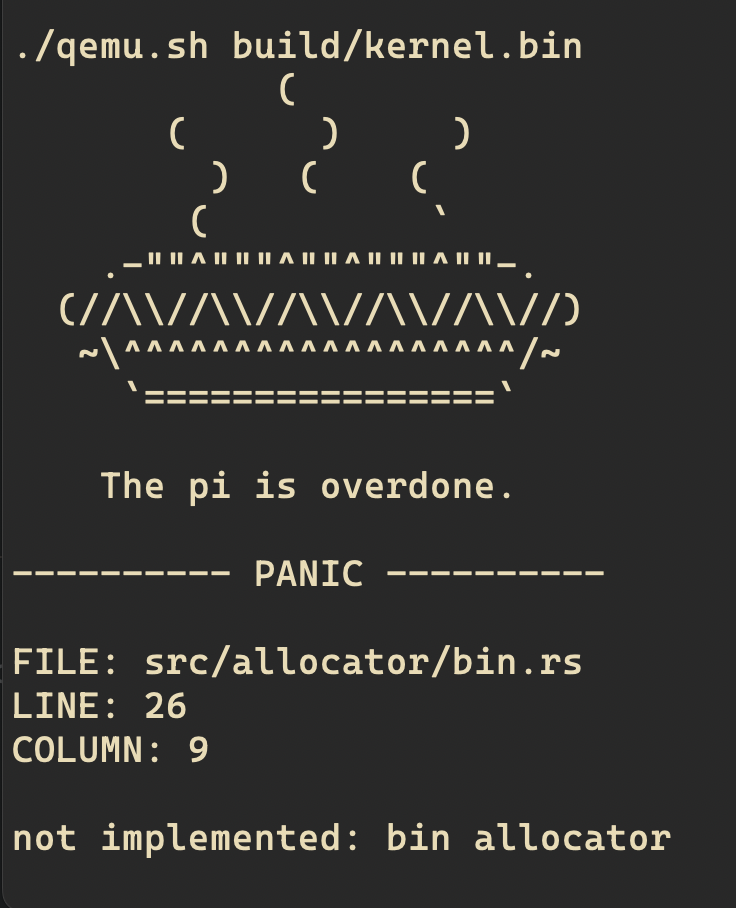
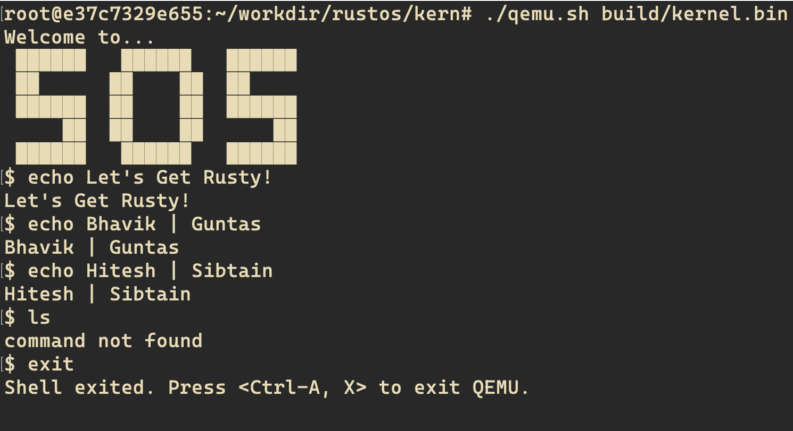

# Team-8 Let's Get Rusty!

<div align = "center">
    
</div>

- Bhavik Patel (22110047)
- Guntas Singh Saran (22110089)
- Hitesh Kumar (22110098)
- Md Sibtain Raza (22110148)

# Lab 5

## Phase 0: `Getting Started`

## Phase 1: `Memory Lane`

### SubPhase A: `Panic!`

The file to work in `./kern/init/panic.rs` and the function to implement is `panic!`. In order to run without the `FAT32` filesystem, we need to modify the `Makefile`, `qemu.sh` and `./kern/Cargo.toml` files.

```toml
[dependencies]
pi = { path = "../lib/pi" }
shim = { path = "../lib/shim", features = ["no_std", "alloc"] }
stack-vec = { path = "../lib/stack-vec/" }
# fat32 = { path = "../lib/fat32/", features = ["no_std"] }

# commented out the fat32 dependency
```

In `./kern/Makefile` added a new target `qemu-n` specifying the simple kernel without the `FAT32`

```bash
qemu-n: bin
	./qemu.sh build/$(KERN).bin

qemu: bin
	./qemu.sh build/$(KERN).bin -drive file=$(SDCARD),format=raw,if=sd $(QEMU_ARGS)
```

hence in `./kern` run

```bash
make qemu-n
```

To compile and run the kernel without the `FAT32` filesystem, in `./kern` run:

```bash
cargo run
```

<div align = "center">
    
</div>

### SubPhase B: `ATAGS`

Files to be taken care of were: `lib/pi/src/atags/atag.rs` and `lib/pi/src/atags/raw.rs`

### SubPhase C: `Warming Up`

Files to be taken care of were: `./kern/src/allocator/util.rs` and `./kern/src/allocator.rs`. There was one issue with `./kern/allocator.rs`:

```rust
// impl fmt::Debug for Allocator {
//     fn fmt(&self, f: &mut fmt::Formatter<'_>) -> fmt::Result {
//         match self.0.lock().as_mut() {
//             Some(ref alloc) => write!(f, "{:?}", alloc)?,
//             None => write!(f, "Not yet initialized")?,
//         }
//         Ok(())
//     }
// }

// Changed to:

impl fmt::Debug for Allocator {
    fn fmt(&self, f: &mut fmt::Formatter<'_>) -> fmt::Result {
        match self.0.lock().as_mut() {
            Some(ref alloc) => write!(f, "Allocator initialized at {:p}", alloc)?,
            None => write!(f, "Not yet initialized")?,
        }
        Ok(())
    }
}
```

### SubPhase D: `Bump Allocator`

`./kern/src/allocator/bump.rs`

### SubPhase E: `Bin Allocator`

`./kern/src/allocator/bin.rs`

# Lab 4

## SubPhase A: `Getting Started`

## SubPhase B: `System Timer`

**Question**: Why can’t you write to CLO or CHI? (restricted-reads) The BCM2837 documentation states that the CLO and CHI registers are read-only. Our code enforces this property. How? What prevents us from writing to CLO or CHI?

**Answer**: The code enforces that `CLO` and `CHI` are read-only by declaring them as `ReadVolatile<u32>`. This type only provides a method for reading the value, which prevents any write operations. If they were declared as `Volatile<u32>`, the API would allow writes, which could lead to accidental modifications of registers that are specified as read-only by the BCM2837 documentation, potentially causing undefined behavior or hardware errors.

## SubPhase C: `GPIO (General Purpose Input/Output)`

**Question**: What would go wrong if a client fabricates states? (fake-states)
Consider what would happen if we let the user choose the initial state for a Gpio structure. What could go wrong?

**Answer**: If clients fabricate states, they can bypass the type safety guarantees. This means a `GPIO` pin might be marked as, say, Output without proper initialization, allowing methods like `set()` or `clear()` to be called incorrectly, which could lead to hardware misconfiguration and undefined behavior.

## SubPhase D: `UART (Universal Asynchronous Receiver-Transmitter)`

**Question**: Why should we never return an `&mut T` directly? (drop-container)
You’ll notice that every example we’ve provided wraps the mutable reference in a container and then implements Drop for that container. What would go wrong if we returned an `&mut T` directly instead?

**Answer**: Returning an `&mut T` directly would allow clients to bypass the type system and Rust’s borrow checker. This could lead to multiple mutable references to the same memory, which is undefined behavior in Rust. By wrapping the mutable reference in a container, we ensure that the mutable reference is unique and that the container’s Drop implementation correctly releases the reference when it goes out of scope.

**Question**: Where does the `write_fmt` call go? (write-fmt)
The `_print` helper function calls `write_fmt` on an instance of `MutexGuard<Console>`, the return value from `Mutex<Console>::lock()`. Which type will have its `write_fmt` method called, and where does the method implementation come from?

**Answer**: The `write_fmt` method is called on the `Console` type, which is the inner type of the `MutexGuard<Console>`. The `write_fmt` method implementation comes from the `core::fmt::Write` trait, which is implemented for `Console`. The `MutexGuard` type dereferences to `Console`, allowing the `write_fmt` method to be called on the `Console` instance.

## SubPhase E: `Shell`

<div align = "center">
    
</div>

**Question**: How does your shell tie the many pieces together? (shell-lookback)
Your shell makes use of much of the code you’ve written. Briefly explain: which pieces does it makes use of and in what way?

**Answer**: The `shell.rs` ties together various components of the system by leveraging the code written for `StackVec`, `TTYWrite`, `XMODEM`, `UART`, `Console`, `GPIO`, and `System Timer`. Here's a brief explanation of how each piece is utilized:

**StackVec**: The shell uses `StackVec` to manage command history and input buffers efficiently. StackVec provides a fixed-capacity vector that ensures memory safety and prevents overflow, which is crucial for handling user inputs and command storage.

**TTYWrite**: The `TTYWrite` module is used for writing output to the terminal. It ensures that the shell can display command results, error messages, and other outputs to the user in a consistent and controlled manner.

**XMODEM**: The `XMODEM` protocol is used for file transfers within the shell. It allows the shell to send and receive files over serial connections, enabling functionalities like uploading and downloading files to and from the system.

**UART**: The `UART` module provides the underlying communication mechanism for serial input and output. The shell uses `UART` to read user commands from the terminal and to send responses back. It ensures reliable data transmission and reception.

**Console**: The `Console` module is responsible for handling formatted output. The shell uses the `Console` to format and print messages, leveraging the `write_fmt` method to ensure that output is correctly formatted and displayed.

**GPIO**: The `GPIO` module allows the shell to interact with the hardware's general-purpose input/output pins. This can be used for various purposes, such as controlling LEDs or reading button states, providing a way for the shell to interact with the physical world.

**System Timer**: The `System Timer` module is used for managing time-related functions within the shell. It allows the shell to implement features like command timeouts, delays, and scheduling tasks, ensuring that time-sensitive operations are handled accurately.

By integrating these components, the shell can provide a robust and interactive environment for users to execute commands, manage files, and interact with the system hardware. Each piece plays a crucial role in ensuring the shell's functionality, reliability, and performance.

# Lab 3

## SubPhase A: `Stack-Vec`

**Question**: Why does push return a Result?

**Answer**: `StackVec::push` can fail because the backing storage has a fixed capacity. If the StackVec is full, push returns an Err to indicate that the operation failed.
Vec dynamically allocates memory, so it can grow as needed. StackVec cannot grow beyond its fixed capacity, so push must handle the case where the vector is full.

**Question**: Why is the `'a` bound on `T` required?

**Answer**: The 'a bound ensures that any references inside T (if T contains references) are valid for the lifetime 'a of the backing storage. Without this bound, StackVec could store references that outlive the backing storage, leading to dangling references (accessing invalid memory).
Vec owns its elements, so it can move them out of the vector without cloning.

**Question**: Why does `StackVec` require `T: Clone` to `pop()`?

**Answer**: `StackVec::pop` removes the last element from the vector and returns it. Since StackVec borrows its storage (it doesn’t own the elements), it cannot move elements out of the slice directly. Instead, it clones the element before removing it.

**Question**: Which Tests Use `Deref` and `DerefMut`?

**Answer**:

- **Tests Using Deref**: Any test that treats StackVec as a slice (e.g., indexing, slicing, or calling slice methods like len() or iter()).
- **Tests Using DerefMut**: Any test that modifies StackVec as a slice (e.g., sorting or mutating elements).
  All those tests will be failing if Deref and DrefMut are not implemented.

## SubPhase B: `Volatile`

**Question**: Why does `Unique<Volatile>` exists? What is difference between `Volatile` and `Unique<Volatile>`?

**Answer**: `Unique<Volatile>` is a wrapper around a raw pointer that ensures the pointer is unique (i.e., no other references point to the same memory). This is necessary because `Volatile` requires exclusive access to the memory it points to. If multiple references to the same memory existed, they could concurrently read or write to the memory, violating the guarantees provided by `Volatile`.

**Question**: How are read-only and write-only accesses enforced? The `ReadVolatile` and `WriteVolatile` types make it impossible to write and read, respectively, the underlying pointer. How do they accomplish this?

**Answer**: `ReadVolatile` and `WriteVolatile` enforce read-only and write-only accesses by wrapping a `Unique<Volatile>` pointer and providing methods that only allow reading or writing, respectively. For example, `ReadVolatile` provides a `read` method that reads the value at the pointer, while `WriteVolatile` provides a `write` method that writes a value to the pointer. These methods ensure that the underlying pointer is only used for the intended access type (read or write).

**Question**: What do the macros do? What do the `readable!`, `writeable!`, and `readable_writeable!` macros do?

**Answer**: The `readable!`, `writeable!`, and `readable_writeable!` macros generate implementations of the `Readable` and `Writeable` traits for the specified types. These traits provide methods for reading (`read_volatile `) and writing (`write_volatile`) values from/to memory, respectively. The macros generate implementations for the specified types, allowing them to be used with `ReadVolatile` and `WriteVolatile` to read and write values from/to memory.

## SubPhase D: `TTYWrite`

**Question**: What happens when a flag’s input is invalid?

**Answer**: `StructOpt` rejects invalid flag values because custom parsing functions (e.g., parse_flow_control) return a Result. For example, if -f idk is provided, parse_flow_control returns an Err, prompting `StructOpt` to display an error and exit. These parsers validate inputs by returning `Ok` only for valid values, ensuring invalid inputs are rejected early in argument parsing.

**Question**: Why does the `test.sh` script always set -r? (bad-tests)

**Answer**: The `test.sh` script uses -r (raw mode) because XMODEM requires a responsive receiver for protocol handshakes (e.g., ACK/NAK). Testing with XMODEM would need a mock receiver that implements the protocol, which the script's PTY setup lacks. Raw mode bypasses this by transmitting data directly without protocol checks, simplifying validation of basic I/O functionality without complex two-way communication emulation.

# CS330 Lab assignments

This repository contains lab assignments for CS330 "Operating Systems".

## Why Rust?

Historically, C has been mainly used for OS development because of its portability,
minimal runtime, direct hardware/memory access, and (decent) usability.  
Rust provides all of these features with addition of memory safety guarantee,
strong type system, and modern language abstractions
which help programmers to make less mistakes when writing code.

## Why are we using older Rust toolchains?

The features we require for low level, OS independent Rust are still experimental.
Many of the said features which needed 3rd party dependencies are in a phase of
moving over to official Rust `core`.  
And therefore the handover has caused abandonment of these 3rd party projects.
To use these dependencies, we have to use older nightly versions of Rust.

## Can we use latest Rust nightly?

You are free to port the code over to newer versions, and will recieve significant
bonus points for it. We will try to help you if you get stuck.  
But sadly, this endeavour will not be considered for deadline extension. ¯\\\_(ツ)\_/¯

## Acknowledgement

We built our labs based on the materials developed for
`Georgia Tech CS3210` and `CS140e: An Experimental Course on Operating Systems` by Sergio Benitez.  
We want to port it to use newer toolchains such as Rust 2021 (or hopefully 2024) edition and
Raspberry 5 if possible.
